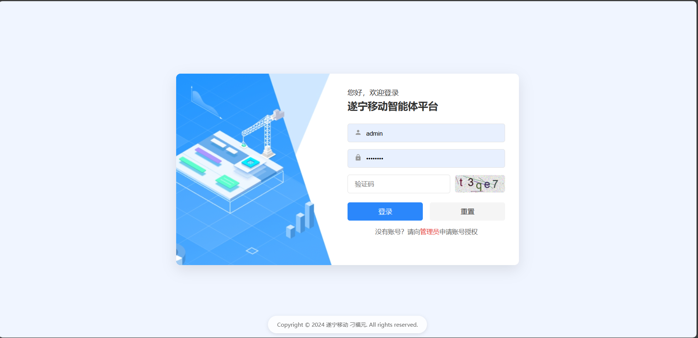
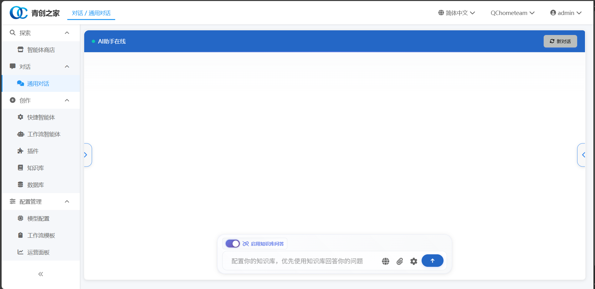
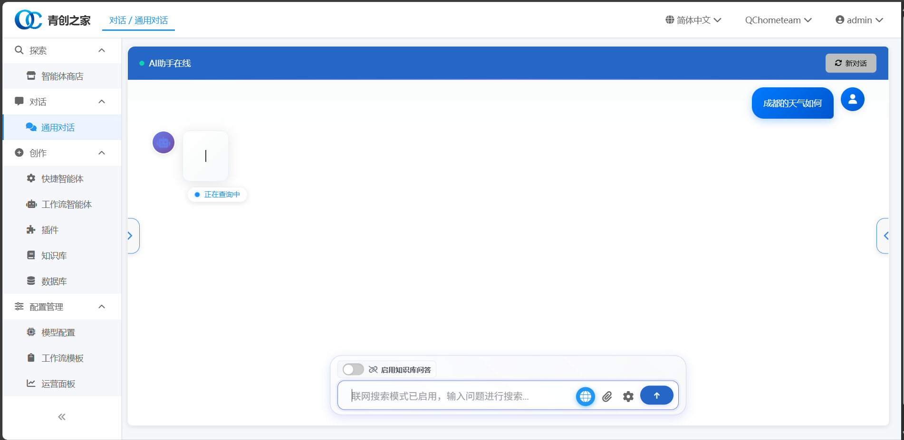
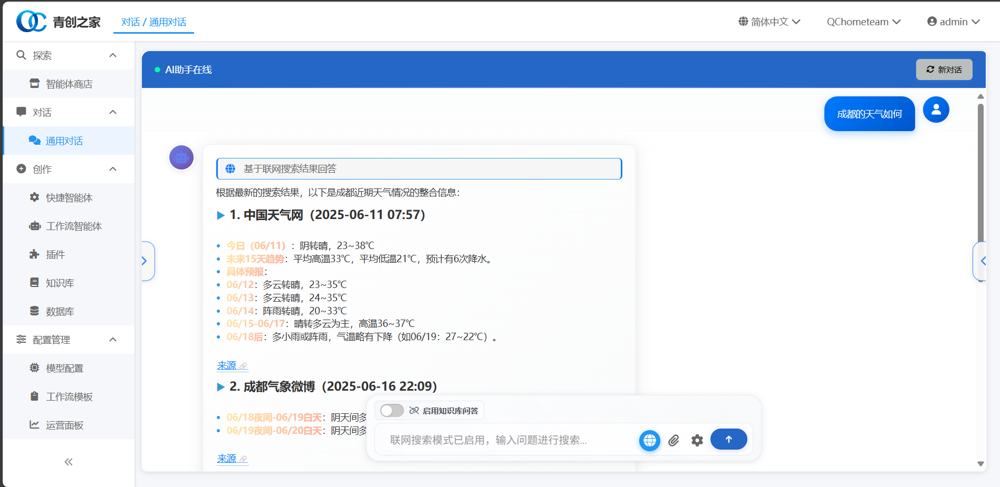
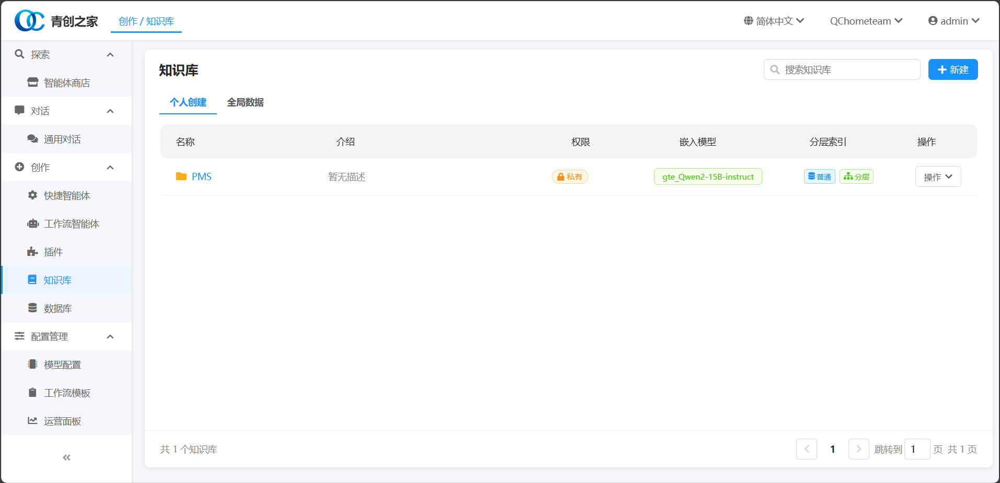
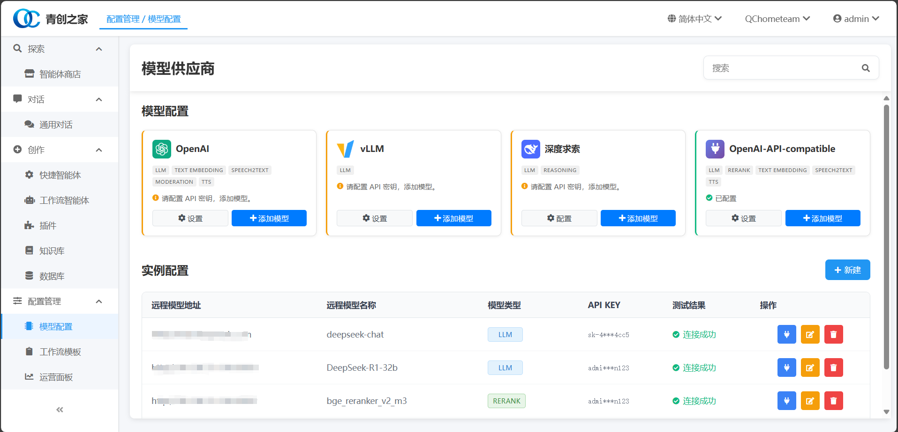

# 智能体平台

一个基于FastAPI的现代化智能体平台，集成了多种AI模型、知识库管理、分层检索和RAG对话功能。

## ✨ 核心特性

### 🤖 多模型AI聊天
- **多平台支持**：OpenAI GPT、DeepSeek、Anthropic Claude
- **流式对话**：实时响应，支持长文本生成
- **上下文管理**：智能对话历史记录和上下文感知
- **自定义提示词**：支持学术、代码、创意等多种场景模板

### 📚 智能知识库系统
- **多格式文档支持**：PDF、Word、PPT、Excel、TXT、Markdown等
- **OCR文字识别**：基于RapidOCR的图片文字提取
- **智能文档解析**：结构化提取文档内容和元数据
- **向量化存储**：基于FAISS的高效向量检索
- **分层索引构建**：摘要-块两级索引，提升检索精度

### 🔍 高级检索引擎
- **分层检索器**：HierarchicalRetrieverService，先摘要后细节
- **混合检索**：语义检索 + 关键词检索 + BM25算法
- **智能查询分解**：复杂查询自动分解为多个子查询
- **相关性重排**：基于多种算法的结果重新排序
- **上下文窗口管理**：智能控制检索结果长度

### 🎯 RAG增强对话
- **知识库问答**：基于私有知识库的精准问答
- **多轮对话**：保持上下文的连续对话能力
- **实时检索**：动态检索相关文档片段
- **答案溯源**：显示答案来源文档和置信度

### 🛠️ 系统管理功能
- **用户认证**：基于JWT的安全认证机制
- **权限管理**：细粒度的用户权限控制
- **模型配置**：可视化的AI模型参数配置
- **系统监控**：实时监控系统状态和性能指标
- **日志管理**：完整的操作日志和错误追踪

## 🛠️ 技术栈

### 后端
- **FastAPI**: 现代化的Python Web框架
- **LangChain**: LLM应用开发框架
- **SQLAlchemy**: ORM数据库操作
- **Chroma**: 向量数据库
- **NLTK**: 自然语言处理

### 前端
- **HTML/CSS/JavaScript**: 原生Web技术
- **Bootstrap**: 响应式UI框架
- **FontAwesome**: 图标库

### AI/ML
- **Sentence Transformers**: 文本嵌入模型
- **HuggingFace**: 预训练模型
- **OpenAI API**: GPT模型接口
- **DeepSeek API**: 国产大模型接口

## 📦 安装部署

### 环境要求
- Python 3.8+
- pip 或 conda
- Git

### 快速开始

1. **克隆项目**
```bash
git clone <your-repo-url>
cd web_new
```

2. **安装依赖**
```bash
pip install -r requirements.txt
```

3. **配置环境变量**
```bash
# 复制环境变量模板
cp dfy_langchain/.env.example dfy_langchain/.env
# 编辑配置文件，填入API密钥等信息
```

4. **启动服务**
```bash
python run.py
```

5. **访问应用**
打开浏览器访问: http://localhost:8000

### Docker部署

```bash
# 构建镜像
docker build -t intelligent-agent .

# 运行容器
docker-compose up -d
```

## 📁 项目结构

```
web_new/
├── app/                    # 主应用目录
│   ├── routers/           # API路由
│   ├── services/          # 业务逻辑
│   ├── models/            # 数据模型
│   └── static/            # 静态资源
├── dfy_langchain/         # LangChain扩展
│   ├── retrievers/        # 检索器模块
│   ├── document_loaders/  # 文档加载器
│   └── embedding_model/   # 嵌入模型
├── data/                  # 数据存储
│   ├── knowledge_base/    # 知识库文件
│   └── uploads/           # 上传文件
├── templates/             # HTML模板
├── config/                # 配置文件
└── requirements.txt       # 依赖列表
```

## 🔧 配置说明

### 环境变量配置
在 `dfy_langchain/.env` 文件中配置以下变量：

```env
# LLM API配置
DEEPSEEK_API_KEY=your_deepseek_api_key
OPENAI_API_KEY=your_openai_api_key
ANTHROPIC_API_KEY=your_anthropic_api_key

# 数据库配置
DATABASE_URL=sqlite:///./data/agents.db

# 向量存储配置
VECTOR_STORE_PATH=./data/knowledge_base

# 嵌入模型配置
EMBEDDING_MODEL_PATH=./dfy_langchain/embedding_model/bce-embedding-base_v1
```

## 📚 使用指南

### 知识库管理
1. 登录系统后，进入知识库管理页面
2. 创建新的知识库
3. 上传文档（支持PDF、Word、Excel等格式）
4. 系统自动进行文档解析和向量化
5. 配置检索参数和分层索引

### 智能对话
1. 选择或创建智能体
2. 配置LLM模型和参数
3. 关联知识库（可选）
4. 开始对话交互

### 分层检索
1. 在知识库设置中启用分层索引
2. 系统自动构建摘要和块级索引
3. 检索时优先使用摘要，必要时回退到块级检索

## 🤝 贡献指南

1. Fork 本仓库
2. 创建特性分支 (`git checkout -b feature/AmazingFeature`)
3. 提交更改 (`git commit -m 'Add some AmazingFeature'`)
4. 推送到分支 (`git push origin feature/AmazingFeature`)
5. 打开 Pull Request

## 📄 许可证

本项目采用 MIT 许可证 - 查看 [LICENSE](LICENSE) 文件了解详情

## 🆘 支持

如果您遇到问题或有建议，请：
- 提交 [Issue](../../issues)
- 发送邮件至: [992697817@qq.com]
- 查看 [文档](./docs/)

## 🙏 致谢

感谢以下开源项目的支持：
- [Langchatchat](https://github.com/langchatchat/langchatchat)
- [FastAPI](https://fastapi.tiangolo.com/)
- [LangChain](https://python.langchain.com/)
- [Chroma](https://www.trychroma.com/)
- [Sentence Transformers](https://www.sbert.net/)

---

⭐ 如果这个项目对您有帮助，请给我们一个星标！


## 📸 界面展示

### 主界面


### 智能对话界面


### 知识库管理


### 文档上传与处理


### 系统配置


### 检索结果展示


